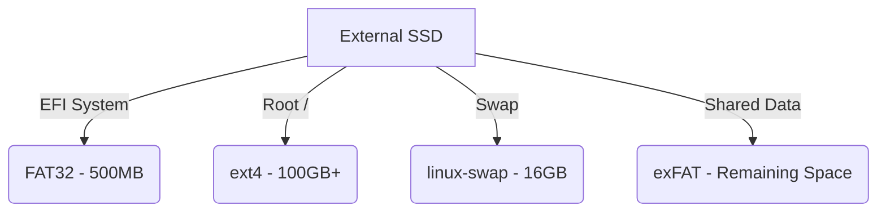

  

  **The Complete Beginner's Guide to Linux Development and Portable Workstations**

   

  
  

 

## 📖 Introduction

Welcome to the **Ubuntu External SSD Guide** – an open-source handbook designed for absolute beginners. 

This guide teaches you how to install Ubuntu on an external SSD while keeping your Windows installation completely untouched. By following this 50+ chapter handbook, you will transform from a Windows user into a confident Linux developer with a fully functional, portable development environment in your pocket.

---

## ✨ Features

- 🛡️ **Zero Risk to Windows:** Run a full Linux environment without touching your internal hard drive.
- 📚 **50+ In-Depth Chapters:** Master theory, practice with examples, and test yourself with quizzes.
- 🎒 **Portability:** Carry your entire development environment in your pocket and boot it on almost any PC.
- 🛠️ **Developer Workflows:** Complete setup guides for VS Code, Git, Docker, Node.js, Python, PostgreSQL, and more.
- ⚡ **Master the Terminal:** Learn bash scripting, file permissions, cron jobs, and system monitoring.

---

## 🏗️ Architecture Layout

*(See [Chapter 21: Partitioning](docs/21-partitioning.md) for full details)*

---

## 🚀 Getting Started

This guide is designed to be read sequentially. 

1. **[Theory (Chapters 1-12):](docs/01-introduction.md)** Understand why Linux is useful and how modern booting works.
2. **[Preparation (Chapters 13-19):](docs/13-download-ubuntu.md)** Download Ubuntu and create a bootable USB drive.
3. **[Installation (Chapters 20-23):](docs/20-installation.md)** Install Ubuntu on your external SSD.
4. **[Developer Setup (Chapters 24-42):](docs/24-system-update.md)** Install and configure modern developer tools.
5. **[Mastering Linux (Chapters 43-56):](docs/43-linux-terminal.md)** Master the terminal, permissions, and security.

---

## 🤝 Connect With Me

Built by **Chandan Pal**. I'm always open to connecting, discussing tech, or helping out beginners!

  
  
  
  

---

## 📄 License & Contribution

We welcome contributions! This project is maintained for beginners, by developers who care about education. Please see [CONTRIBUTING.md](CONTRIBUTING.md) to get started.

This project is licensed under the [MIT License](LICENSE).
