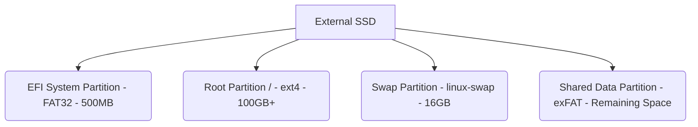

<div align="center">
  

  # ubuntu-external-ssd-guide
  **The Complete Beginner's Guide to Ubuntu, Linux Development and Portable Developer Workstations**

  [](https://opensource.org/licenses/MIT)
  [](http://makeapullrequest.com)
  [](https://github.com/username/ubuntu-external-ssd-guide/actions)
  [](https://github.com/username/ubuntu-external-ssd-guide/actions)
</div>

---

## 📖 Introduction

Welcome to the **Ubuntu External SSD Guide** – the most comprehensive, beginner-friendly, open-source handbook for setting up a portable developer workstation. 

This repository is designed to teach absolute beginners how to install Ubuntu on an external SSD while keeping their Windows installation completely untouched. By following this guide, you will transform from a Windows user with zero Linux experience into a confident Linux developer with a fully functional, portable development environment.

Whether you're a student, web developer, DevOps beginner, or AI enthusiast, this guide covers everything from understanding BIOS and UEFI to writing shell scripts and deploying web applications.

---

## 🚀 Features

- **Zero Risk to Windows:** Learn how to run a full Linux environment without modifying your internal hard drive.
- **50+ In-Depth Chapters:** Covering theory, practical examples, exercises, and quizzes.
- **Portability:** Carry your entire development environment in your pocket. Boot it on (almost) any PC.
- **Developer Workflows:** Setup guides for VS Code, Git, Docker, Node.js, Python, PostgreSQL, and more.
- **Troubleshooting & FAQ:** Over 150 common problems solved and 300+ beginner questions answered.
- **High-Quality Visuals:** Diagrams, screenshots, and terminal output examples to guide you visually.

---

## 📋 Table of Contents

- [Introduction](#-introduction)
- [Architecture & SSD Layout](#-architecture--ssd-layout)
- [Requirements](#-requirements)
- [Installation](#-installation)
- [Documentation Structure](#-documentation-structure)
- [Roadmap](#-roadmap)
- [Contributing](#-contributing)
- [License](#-license)
- [Support](#-support)

---

## 🏗️ Architecture & SSD Layout



*(See [Chapter 21: Partitioning](docs/21-partitioning.md) for full details)*

---

## ⚙️ Requirements

### Hardware
- A PC or Laptop (currently running Windows)
- An External SSD (Minimum 256GB recommended)
- A USB Flash Drive (Minimum 8GB for the Ubuntu Installer)
- An internet connection

### Software
- [Ubuntu ISO](https://ubuntu.com/download/desktop)
- [Rufus](https://rufus.ie/) or [Ventoy](https://www.ventoy.net/) (for creating the bootable USB)

---

## 🛠️ Installation

This guide is designed to be read sequentially. Start with the early chapters to understand the concepts, and follow along with the practical steps.

1. **Read the Theory:** Chapters 1-12 cover why Linux is useful and how modern computer boot processes work.
2. **Prepare the Media:** Chapters 13-19 cover downloading Ubuntu and creating a bootable USB drive.
3. **Install Ubuntu:** Chapters 20-23 guide you through the actual installation on your external SSD.
4. **Developer Setup:** Chapters 24-42 walk you through installing and configuring developer tools.
5. **Mastering Linux:** Chapters 43-52 cover terminal commands, file permissions, scripting, and security.

---

## 📚 Documentation Structure

The documentation is located in the `docs/` directory.

- [01. Introduction](docs/01-introduction.md)
- [02. Why Linux?](docs/02-why-linux.md)
- [03. Linux History](docs/03-linux-history.md)
- [04. What is Ubuntu?](docs/04-ubuntu.md)
- ... and 50+ more chapters!

---

## 🗺️ Roadmap

- [x] Complete chapters 1-20 (Foundation & Installation)
- [x] Complete chapters 21-40 (Developer Tools & Environments)
- [x] Complete chapters 41-56 (Advanced Concepts, Troubleshooting, FAQ)
- [x] Shell scripts for automated setup
- [ ] Multi-language translations (Spanish, French, Hindi)
- [ ] Video tutorials for each chapter

---

## 🤝 Contributing

We welcome contributions from the community! This project is maintained for beginners, by developers who care about education. 

Please see our [CONTRIBUTING.md](CONTRIBUTING.md) file for detailed instructions on how to contribute, and our [CODE_OF_CONDUCT.md](CODE_OF_CONDUCT.md) for community guidelines.

---

## 📄 License

This project is licensed under the MIT License - see the [LICENSE](LICENSE) file for details.

---

## ❤️ Support

If this guide helped you, consider supporting the project:
- ⭐ Star the repository on GitHub
- 💬 Share it with friends and colleagues
- 🐛 Report issues or suggest improvements

---

## 📁 Project Tree

```text
ubuntu-external-ssd-guide/
├── .github/
├── assets/
├── docs/
├── scripts/
├── README.md
├── LICENSE
├── CONTRIBUTING.md
└── SECURITY.md
```
