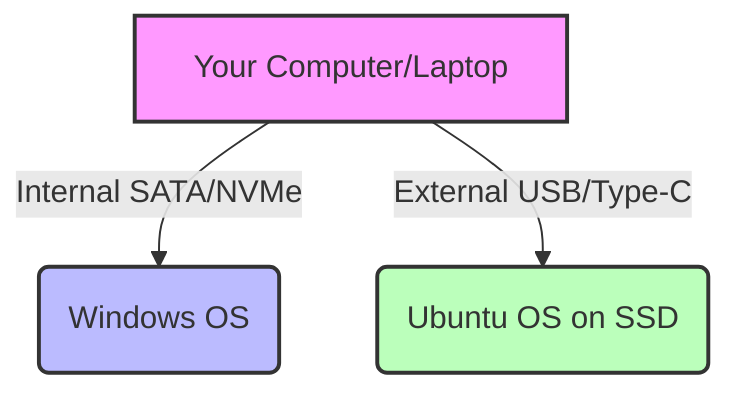

# Chapter 1: Introduction

Welcome to the **Ubuntu External SSD Guide**! If you are reading this, you likely have a Windows computer, a curiosity about Linux, and a desire to learn without risking your current setup. You are in exactly the right place.

## Learning Objectives
By the end of this chapter, you will:
- Understand the core goal of this guide.
- Know exactly what a "Portable Developer Workstation" is.
- Understand why installing Linux on an external SSD is the safest way to learn.
- Be familiar with the structure of this guide.

---

## Theory: What Are We Building?

When beginners want to learn Linux, they are often presented with a few options:
1. **Virtual Machines (VMs):** Running Linux inside an app on Windows (like VirtualBox). This is safe, but notoriously slow, laggy, and doesn't give you access to your computer's full hardware power (like the Graphics Card).
2. **Dual Booting:** Shrinking your Windows partition and installing Linux next to it. This is fast, but **dangerous**. One wrong click during installation, and you can delete Windows entirely. Furthermore, Windows updates have a habit of breaking Linux dual-boot setups.
3. **WSL (Windows Subsystem for Linux):** Good for running quick terminal commands, but you aren't truly using a Linux operating system. You are missing out on the desktop experience and full system control.

### The Superior Method: The External SSD

We are going to use a fourth method. We will install **Ubuntu** (a very popular, beginner-friendly version of Linux) completely onto an **External USB SSD** (Solid State Drive).

> [!TIP]
> **What is an SSD?**
> An SSD is a modern, incredibly fast storage drive. Because modern USB ports (like USB 3.0 or USB-C) are very fast, running an entire operating system off an external SSD feels just as fast as running it from inside your computer.

### The Portable Developer Workstation

By putting Linux on an external drive, you are creating a "Portable Developer Workstation." 

This means:
- **Zero Risk:** Your Windows hard drive inside your computer remains completely untouched. You can even unplug your Windows drive physically if you are paranoid, and this guide will still work.
- **Portability:** You can plug this SSD into your laptop, boot it up, write some code, shut it down, take the SSD to a library computer, plug it in, and pick up exactly where you left off. Your entire computer is in your pocket.
- **Full Power:** Unlike a Virtual Machine, Ubuntu will have direct access to your CPU, RAM, and GPU. It will be lightning fast.

---

## Practical Example: The Workflow

Imagine you are a web developer. Your workflow currently looks like this:

1. You turn on your Windows laptop.
2. You plug in your external SSD via USB-C.
3. You restart the computer and press a special key (like `F12`) to open the **Boot Menu**.
4. You select the External SSD.
5. In 10 seconds, you are looking at the beautiful Ubuntu desktop.
6. You open Visual Studio Code, write a Node.js application, and test it using Docker.
7. You shut down the computer, unplug the SSD, and boot back into Windows to play a video game.

Your Windows environment never even knew Linux was there.

---

## Screenshots

*Figure 1.1: A sleek, modern laptop running Ubuntu from an external drive plugged into the side.*

---

## Diagrams

Here is a visual representation of how your computer will interact with the drives:

When the computer turns on, you act as the traffic controller, telling the computer which path to take.

---

## Tips & Warnings

> [!NOTE]
> Throughout this guide, we assume you are using a modern PC (built after 2012) that uses UEFI (we will explain what UEFI is in Chapter 11).

> [!WARNING]
> Do NOT use a USB Flash Drive (thumb drive) for the final installation. Flash drives are meant for moving files, not running operating systems. They will overheat, run incredibly slow, and die within months. You **must** use an external SSD.

---

## Exercises

To make sure you are ready for this guide, complete the following exercise:

1. Look at your computer's USB ports. Identify the fastest port. Usually, USB 3.0 ports are blue, or they have an "SS" (SuperSpeed) logo next to them. USB-C ports are also excellent.
2. Check your Windows C: drive capacity to understand how much storage you currently use. This will help you decide what size external SSD to buy (discussed in Chapter 7).

---

## Quiz

**Question 1:** Why is installing Linux on an external SSD safer than Dual Booting?
- A) Because Linux doesn't like Windows.
- B) Because you don't modify the internal hard drive where Windows lives.
- C) Because external drives are slower.
- D) Because Virtual Machines require it.

Click here for the answer

**Answer: B**. Because you don't modify the internal hard drive where Windows lives, there is zero risk of accidentally deleting your Windows data.

**Question 2:** True or False: You should use a cheap USB thumb drive to run your portable Linux workstation.

Click here for the answer

**Answer: False**. USB thumb drives will run terribly slow and degrade quickly when used to run a full operating system. You need an external SSD.

---

## Summary

In this chapter, we learned that we are going to build a Portable Developer Workstation. By installing Ubuntu on an external SSD, we get the full performance of our computer's hardware without risking our Windows installation. We can take this drive anywhere and have our complete development environment ready to go.

## Next Chapter

Are you wondering why you should even bother learning Linux when Windows works fine? In the next chapter, we will discuss exactly why the professional software development world runs on Linux.

[Go to Chapter 2: Why Linux? ➡️](02-why-linux.md)
