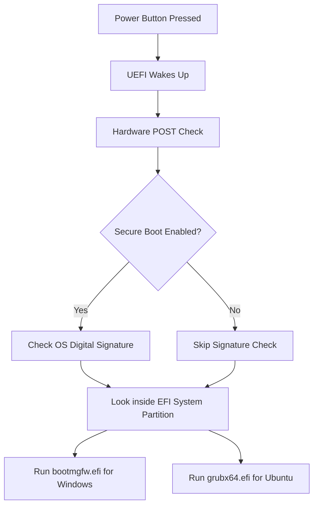

# Chapter 11: UEFI

In the previous chapter, we learned that the ancient BIOS system was too limited for modern hardware. It couldn't use a mouse, it was slow, and it couldn't read hard drives larger than 2TB. 

To solve this, a consortium of tech companies (led by Intel) created the replacement for BIOS. It is called **UEFI**. If you bought a PC after 2012, it uses UEFI.

## Learning Objectives
By the end of this chapter, you will:
- Understand what UEFI is.
- Understand the benefits of UEFI over Legacy BIOS.
- Learn what the "EFI System Partition" is.
- Learn about Secure Boot.

---

## Theory: The Modern Firmware

**UEFI** stands for **Unified Extensible Firmware Interface**.

It does the exact same job as the old BIOS (waking up the hardware and handing control to the operating system), but it does it much better. 

Think of UEFI as a mini operating system that lives on your motherboard. 
- It is 32-bit or 64-bit (blistering fast).
- It has full color graphics.
- You can use your mouse to click on menus.
- It can connect to the internet directly (some motherboards can update themselves before Windows even loads).
- It can boot from hard drives of virtually unlimited size (up to 9.4 Zettabytes).

### The EFI System Partition (ESP)

The biggest difference between the old BIOS and the new UEFI is *how* they find the operating system.

The old BIOS used a tiny, hidden piece of code at the very front of the hard drive (called the MBR) to find Windows. It was fragile and easily corrupted.

UEFI is much smarter. 
UEFI looks for a specific partition on your hard drive formatted as `FAT32`. This is called the **EFI System Partition (ESP)**.
Inside this partition are actual files (with `.efi` extensions). 

When you install Windows, Windows drops a file named `bootmgfw.efi` into this partition.
When you install Ubuntu, Ubuntu drops a file named `grubx64.efi` into this partition.

UEFI simply looks inside this folder, reads the files, and asks you which one you want to run! This is why dual-booting with UEFI is significantly more reliable than the old BIOS days.

### Secure Boot

UEFI introduced a major security feature called **Secure Boot**.
Secure Boot checks the digital signature of the operating system before it allows it to load. If a virus modifies your boot files, the signature will break, and Secure Boot will halt the computer, preventing the virus from running.

*Note for Linux users:* In the early days, Secure Boot prevented Linux from installing because Linux wasn't signed by Microsoft. Today, Ubuntu pays for a Microsoft signature, so Ubuntu will install perfectly fine even with Secure Boot enabled!

---

## Practical Example: Visualizing UEFI

If you press `F2` or `Delete` while a modern computer is turning on, you will enter the UEFI settings. It looks like a high-tech dashboard.

*Figure 11.1: A modern UEFI dashboard showing fan speeds, temperatures, and graphical boot order menus.*

Notice how different this looks from the ugly blue-and-white BIOS screen from the 1990s. You can use your mouse, change the fan curves, and drag-and-drop the boot order icons.

---

## Diagrams

Here is how the UEFI boot process flows:

---

## Tips & Warnings

> [!TIP]
> People still call it the "BIOS". If a tutorial says "Enter your BIOS settings," they mean the UEFI dashboard. The terminology just stuck around. 

> [!WARNING]
> Because we are building a Portable Developer Workstation, we will create a brand new **EFI System Partition** specifically on the External SSD. This ensures your external drive is 100% self-contained and does not rely on the internal Windows drive to boot.

---

## Exercises

1. Look up the key required to enter the UEFI settings for your specific computer brand (e.g., "How to enter BIOS Dell XPS"). It is usually `F2`, `F12`, `Delete`, or `Esc`.
2. Restart your computer and press that key repeatedly as it turns on. Look around the UEFI dashboard (but do not save any changes!). Press `Esc` and exit without saving to let Windows load normally.

---

## Quiz

**Question 1:** How does UEFI find the operating system?
- A) It searches the entire hard drive for `.exe` files.
- B) It looks inside a small FAT32 partition called the EFI System Partition for `.efi` files.
- C) It asks the internet.

Click here for the answer

**Answer: B**. UEFI is essentially a mini-OS that can read FAT32 file systems. It looks for boot files inside the ESP.

**Question 2:** Will Ubuntu work if Secure Boot is enabled?

Click here for the answer

**Answer: Yes**. Modern versions of Ubuntu (and other major distros) carry digital signatures that Microsoft's Secure Boot recognizes and trusts.

---

## Summary

UEFI is the modern replacement for the old BIOS. It features a graphical interface, mouse support, and advanced security features like Secure Boot. Most importantly, it boots operating systems by reading `.efi` files stored inside a dedicated EFI System Partition (ESP).

## Next Chapter

UEFI changed how computers boot, which forced a change in how hard drives are partitioned. In the next chapter, we will explain the difference between the old MBR layout and the modern GPT layout.

[Go to Chapter 12: GPT vs MBR ➡️](12-gpt-vs-mbr.md)
