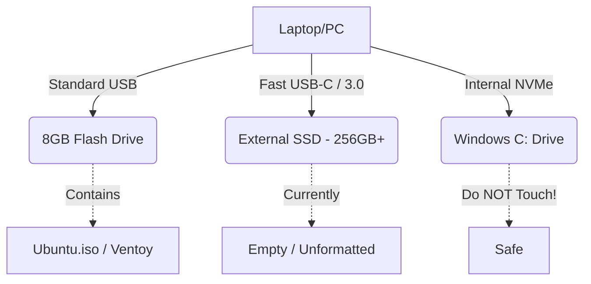

# Chapter 17: Create Bootable USB Summary

This is a short checkpoint chapter. Before we reboot the computer and enter the unknown territory of the Boot Menu, we must ensure our physical hardware is set up perfectly. A single mistake here will prevent the computer from recognizing the Ubuntu installer.

## Learning Objectives
By the end of this chapter, you will:
- Verify your bootable USB drive was created successfully.
- Prepare your physical workspace.
- Understand the next critical steps before restarting Windows.

---

## The Physical Checklist

Please verify the following before proceeding:

1. **The Small USB Installer:** You used Rufus or Ventoy to create the bootable flash drive. It is currently plugged into a standard USB port on your computer.
2. **The External SSD:** You have your large, empty External SSD (Samsung T7, SanDisk, etc.). It is currently plugged into the fastest port on your computer (USB-C or USB 3.0 Blue).
3. **Power:** If you are using a laptop, **PLUG IT INTO THE WALL**. Do not attempt to install an operating system on battery power. If the battery dies during formatting, it can permanently corrupt the drive.
4. **Internet:** Ensure you have access to a Wi-Fi network and know the password, or have an Ethernet cable plugged in. Ubuntu will need internet access during installation to download the latest security patches and graphics drivers.

## The Mental Checklist

This is where beginners usually get nervous. 
*"Am I going to break my computer?"*

If you follow this guide, the answer is **No**.

The danger only occurs if you accidentally select your internal Windows drive during the partitioning phase. We have already mitigated this risk by using an External SSD, which will be incredibly easy to identify by its size and name.

Furthermore, we are about to boot into the **Live Environment** (Chapter 19). This means Ubuntu will run entirely from the small USB stick in your computer's RAM, without touching *any* hard drives. You can play with Ubuntu safely before committing to installing it on the SSD.

---

## Diagrams

This is exactly how your setup should look right now:

---

## Tips & Warnings

> [!WARNING]
> Save all your work in Windows right now. Close your browser tabs (bookmark this guide on your phone so you can read it while the computer restarts). We are about to shut Windows down completely.

---

## Exercises

1. Check your laptop battery icon. Ensure it says "Plugged in".
2. Write down your Wi-Fi password on a piece of paper. You won't be able to look it up in Windows once we restart.
3. Open this guide on your smartphone or a second device so you can read the next chapter while your primary computer is in the Boot Menu.

---

## Summary

You have successfully prepared the hardware and software required. Your small USB stick is a bootable installer, your external SSD is plugged in and ready, and your laptop has wall power. It is time to leave Windows behind and enter the Boot Menu.

## Next Chapter

To boot from the USB stick instead of the internal Windows drive, we have to interrupt the normal boot process. In the next chapter, we will learn how to access the Boot Menu.

[Go to Chapter 18: Boot Menu ➡️](18-boot-menu.md)
