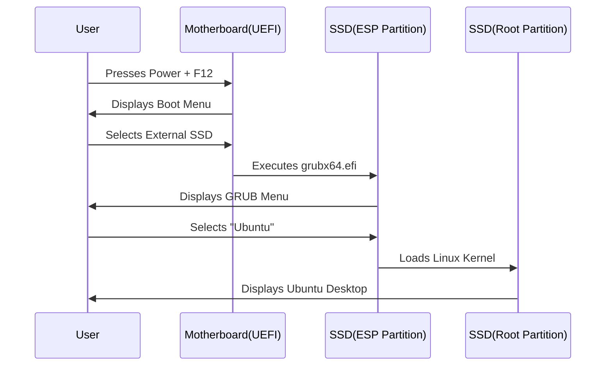

# Chapter 22: The Bootloader (GRUB)

You clicked "Install Now" in the previous chapter. The hard part is over! 

While Ubuntu copies files to your SSD in the background, the installer will ask you for your Timezone and ask you to create a User Account. (Go ahead and fill those out: pick a strong password, and check "Require my password to log in").

While you wait for the progress bar to finish, it's time to understand the piece of software that was just installed into that tiny 500MB EFI partition: **The Bootloader**.

## Learning Objectives
By the end of this chapter, you will:
- Understand what a Bootloader is.
- Understand what GRUB is.
- Know what the GRUB menu looks like and how to navigate it.

---

## Theory: The Middleman

In Chapter 11, we learned that the UEFI firmware tests the hardware, looks inside the EFI System Partition, and executes a `.efi` file. 

But UEFI is not smart enough to actually start the massive Linux kernel, mount the file systems, and load the desktop interface. It needs a middleman. 

That middleman is the **Bootloader**. 

### Introducing GRUB
In the Linux world, the standard bootloader is called **GRUB** (GRand Unified Bootloader). 

When you turn on your computer and select the External SSD from the Boot Menu, UEFI executes `grubx64.efi`. 

GRUB then takes over the screen. Its job is to:
1. Present you with a text-based menu asking which Operating System you want to load.
2. If you don't press anything for 10 seconds, it automatically loads the default OS (Ubuntu).
3. It finds the massive Linux kernel on your `ext4` Root partition, injects it into the computer's RAM, and starts the system.

### The Beauty of Total Isolation

Because we forced the installer to put GRUB on the **External SSD**'s EFI partition (in Chapter 21, Step 6), your computer now has *two completely separate bootloaders*.
- **Internal Drive:** Contains the Windows Boot Manager. 
- **External SSD:** Contains GRUB.

If you unplug the External SSD and turn on your laptop, the computer will only find the Windows Boot Manager. It will boot into Windows instantly, exactly like it did before you bought the SSD. Windows has absolutely no idea that Linux exists. 

If you plug the External SSD in and use the `F12` Boot Menu to select it, the computer will execute GRUB, and Ubuntu will load. 

**This is the definition of a Portable Developer Workstation.**

---

## Practical Example: The GRUB Menu

When the Ubuntu installation finishes, it will ask you to "Restart Now". 
Click Restart. The screen will tell you to remove the installation medium (pull out the small USB flash drive) and press Enter.

When the computer restarts, remember to press your Boot Menu key (like `F12`) and select your **External SSD** again.

The screen will go black, and then a purple or black menu with white text will appear. This is **GRUB**.

It will look something like this:

```text
*Ubuntu
 Advanced options for Ubuntu
 UEFI Firmware Settings
```

- If you press **Enter**, Ubuntu will begin loading.
- "Advanced options" is used for troubleshooting (like booting into an older kernel if a graphics driver update breaks your screen).
- "UEFI Firmware Settings" acts as a shortcut to reboot your computer straight into the motherboard settings.

---

## Diagrams

The Complete Boot Flow of your Portable Workstation:



---

## Tips & Warnings

> [!TIP]
> If you boot up your computer, select the External SSD, and the screen just goes black with a flashing cursor, it usually means the UEFI failed to hand off to GRUB, or Secure Boot is blocking it. Try restarting and trying again.

> [!WARNING]
> Sometimes, GRUB is overly smart. During installation, it might scan your internal hard drive, see Windows, and add "Windows Boot Manager" to the GRUB menu. While you *can* boot Windows through GRUB, it is best practice to always boot Windows natively by simply removing the SSD.

---

## Exercises

1. After the installation finishes and you restart, try to get into the GRUB menu by selecting your External SSD in the F12 Boot Menu.
2. When you see the GRUB menu, use the down arrow key to stop the 10-second countdown. Read the options available.
3. Highlight "Ubuntu" and press Enter.

---

## Quiz

**Question 1:** What is the primary function of GRUB?
- A) It is a text editor for Linux.
- B) It acts as a middleman bootloader, presenting a menu of operating systems and loading the massive Linux kernel into RAM.
- C) It formats hard drives.

<details>
<summary>Click here for the answer</summary>
**Answer: B**. GRUB is the Grand Unified Bootloader, responsible for actually starting the operating system after the UEFI hardware checks.
</details>

**Question 2:** Why did we put GRUB on the External SSD instead of the internal drive?
<details>
<summary>Click here for the answer</summary>
**Answer:** To ensure total hardware isolation. If GRUB was on the internal drive, removing the external SSD would break the computer's ability to boot. By keeping it on the external drive, the Windows drive remains untouched and completely independent.
</details>

---

## Summary

GRUB is the bootloader that bridges the gap between your computer's UEFI firmware and the Linux operating system. By installing it exclusively on the External SSD's EFI partition, you have achieved a perfectly isolated, plug-and-play development environment.

## Next Chapter

Congratulations! You have successfully installed Linux. In the next chapter, we will boot into your new operating system for the very first time and explore the desktop.

[Go to Chapter 23: First Boot ➡️](23-first-boot.md)
